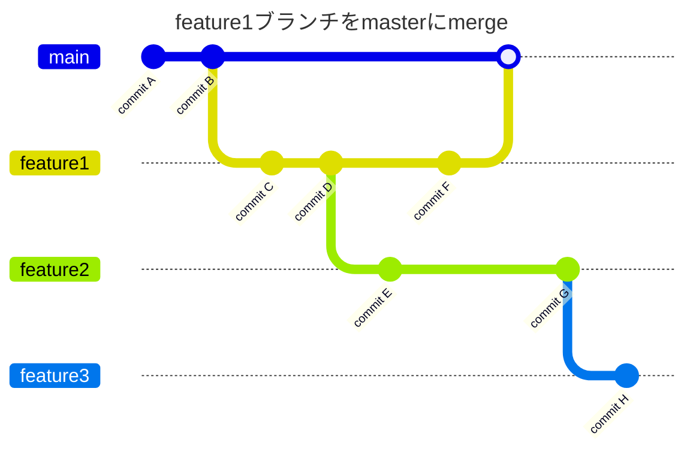
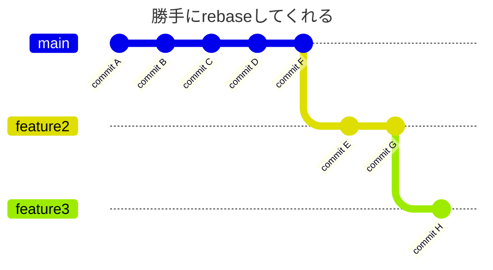

# Stacked Pull Request
https://docs.github.com/ja/pull-requests/reference/stacked-pull-requests

## 概要

- ブランチが直列になっているPR

  ```mermaid
  ---
  title: ブランチイメージ
  ---
  gitGraph
    switch 'main'
    commit id: 'commit A'
    commit id: 'commit B'
    branch 'feature1'
    commit id: 'commit C'
    commit id: 'commit D'
    branch 'feature2'
    commit id: 'commit E'
    switch 'feature1'
    commit id: 'commit F'
    switch 'feature2'
    commit id: 'commit G'
    branch 'feature3'
    commit id: 'commit H'
  ```


### フロー





---

## 複数のブランチが並列に切られている場合
  ```mermaid
  ---
  title: ブランチイメージ(並列に複数のブランチが)
  ---
  gitGraph
    switch 'main'
    commit id: 'commit A'
    commit id: 'commit B'
    branch 'feature1'
    commit id: 'commit C'
    commit id: 'commit D'
    branch 'feature2'
    commit id: 'commit E'
    branch 'feature3'
    switch 'feature2'
    branch 'feature4'
    switch 'feature3'
    commit id: 'commit F'
    switch 'feature2'
    commit id: 'commit G'
    switch 'feature4'
    commit id: 'commit H'
    commit id: 'commit I'
    switch 'feature3'
    commit id: 'commit J'
  ```


https://docs.github.com/ja/pull-requests/reference/stacked-prs-cli-commands

## Stacked PRの設定方法
### GitHubのサイト上から