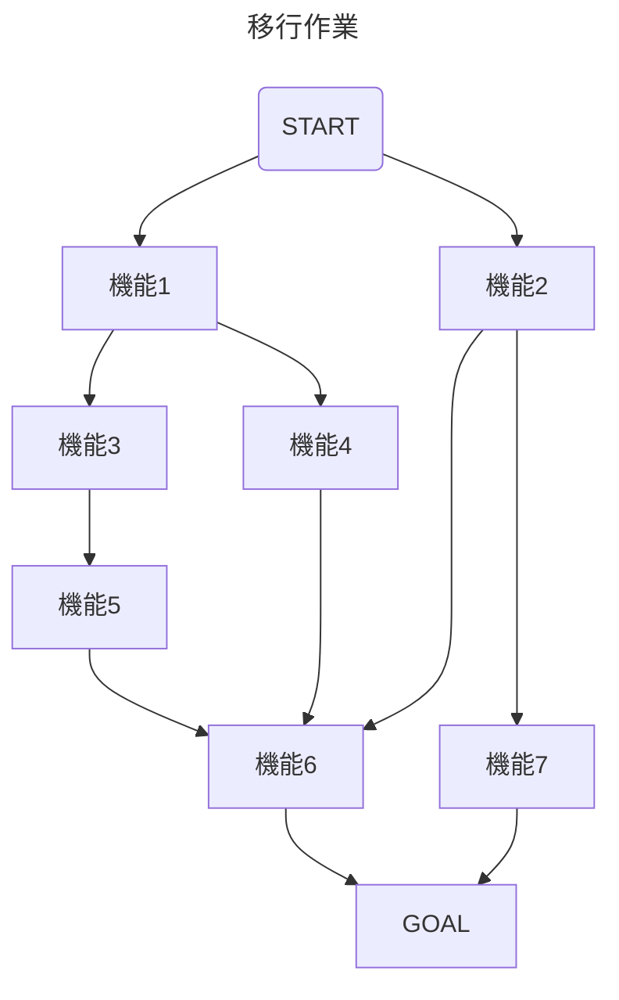
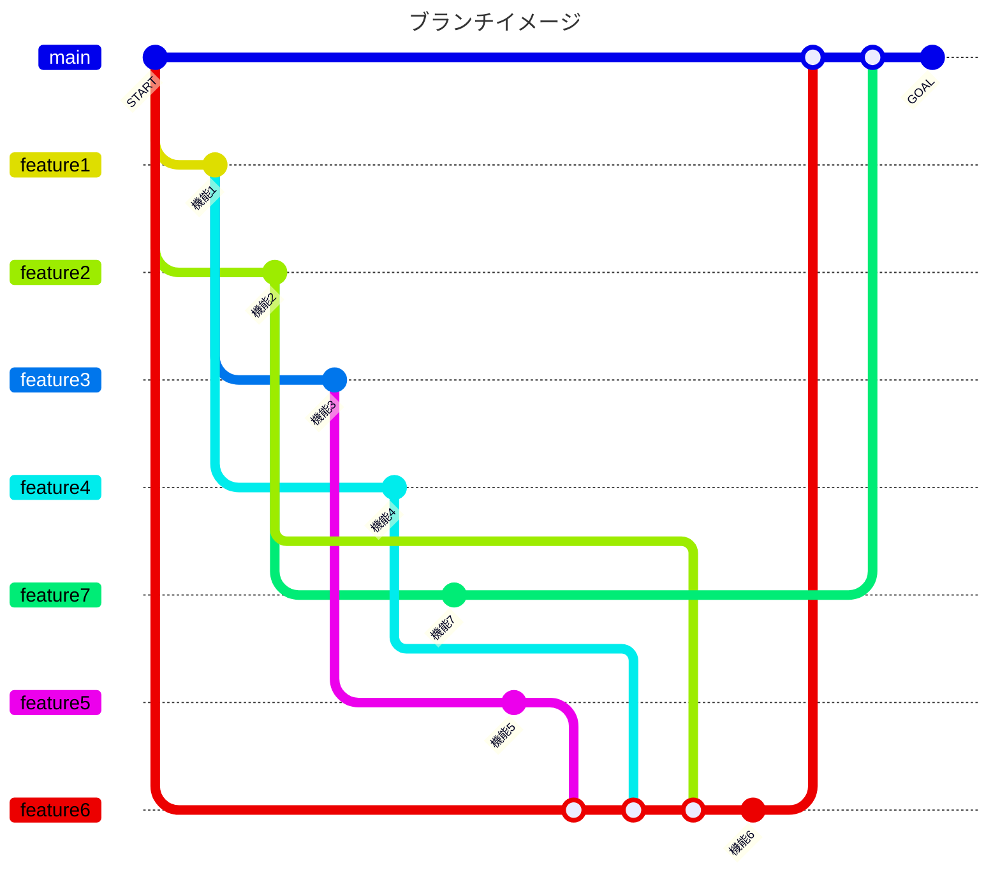
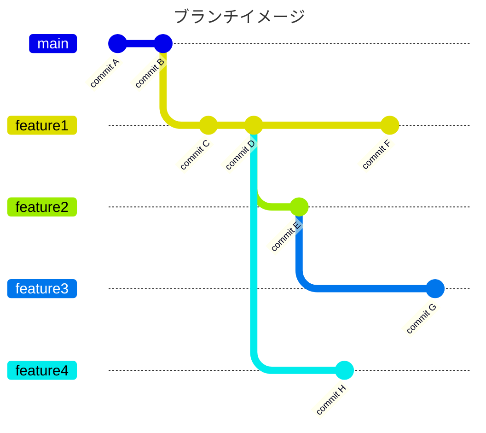
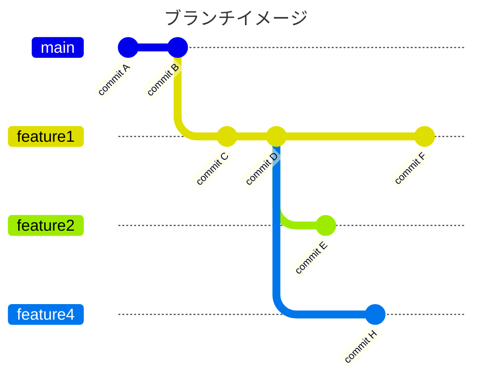
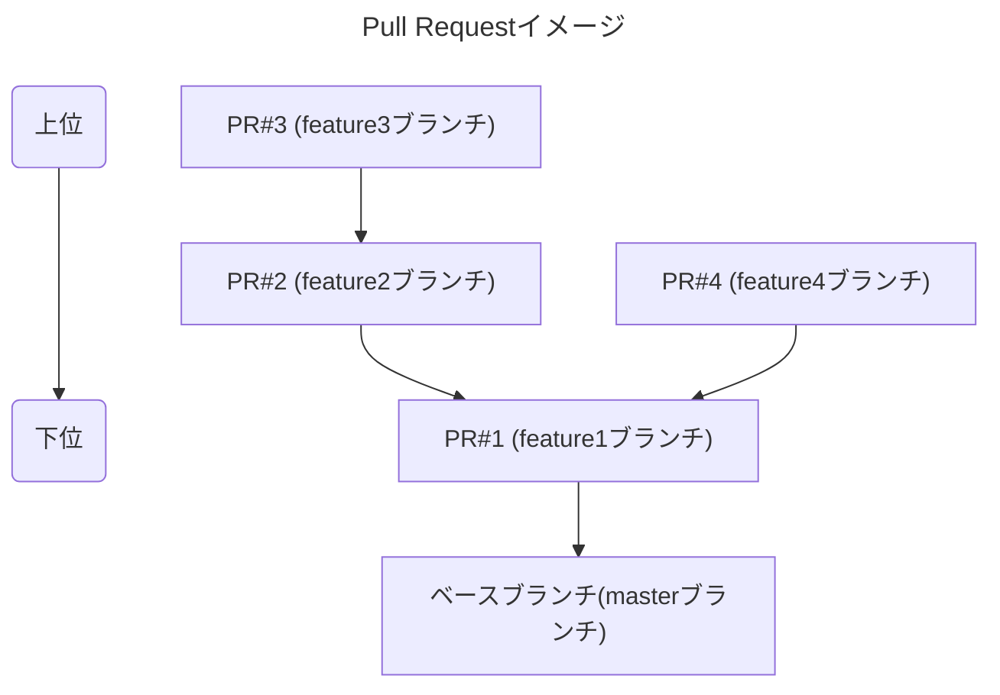
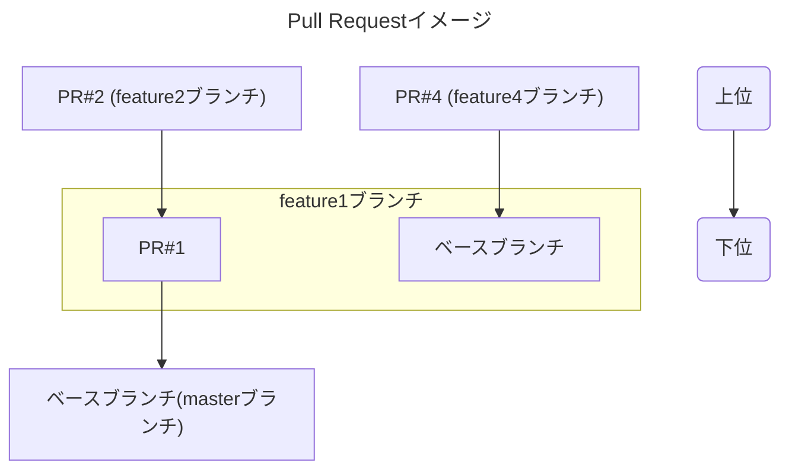

# Stacked Pull Request(3)

## Stacked Pull Requestのユースケース

```mermaid
---
title: 移行作業
---
flowchart TD
    A(START)-->B[機能1]
    A-->C[機能2]
    B-->D[機能3]
    B-->E[機能4]
    D-->F[機能5]
    F-->G[機能6]
    E--->G
    C---->G
    C-->H[機能7]

    G-->Z[GOAL]
    H-->Z
```

```mermaid
---
title: ブランチイメージ
---
gitGraph
  commit id: "START"
  branch feature1
  commit id: "機能1"
  switch main
  branch feature2
  commit id: "機能2"
  switch feature1
  branch feature3
  commit id: "機能3"
  switch feature1
  branch feature4
  commit id: "機能4"
  switch feature2
  branch feature7
  commit id: "機能7"
  switch feature3
  branch feature5
  commit id: "機能5"
  switch main
  branch feature6
  merge feature5
  merge feature4
  merge feature2
  commit id: "機能6"
  switch main
  merge feature6
  merge feature7
  commit id: "GOAL"
```

```mermaid
---
title: ブランチイメージ
---
gitGraph
switch 'main'
commit id: 'commit A'
commit id: 'commit B'
branch 'feature1'
commit id: 'commit C'
commit id: 'commit D'
branch 'feature2'
commit id: 'commit E'
branch 'feature3'
switch 'feature1'
branch 'feature4'
commit id: 'commit H'
switch 'feature1'
commit id: 'commit F'
switch 'feature3'
commit id: 'commit G'
```

```mermaid
---
title: ブランチイメージ
---
gitGraph
switch 'main'
commit id: 'commit A'
commit id: 'commit B'
branch 'feature1'
commit id: 'commit C'
commit id: 'commit D'
branch 'feature2'
commit id: 'commit E'
switch 'feature1'
branch 'feature4'
commit id: 'commit H'
switch 'feature1'
commit id: 'commit F'
```

```mermaid
---
title: Pull Requestイメージ
---
graph TD;
    A(上位) ---> B(下位);
    C["PR#3 (feature3ブランチ)"] 
    --> D["PR#2 (feature2ブランチ)"] 
    --> E["PR#1 (feature1ブランチ)"]
    --> F["ベースブランチ(masterブランチ)"];
    G["PR#4 (feature4ブランチ)"]-->E
```

```mermaid
---
title: Pull Requestイメージ
---
graph TD;
A(上位) --> B(下位);
subgraph feature1_prs [feature1ブランチ]
    E["PR#1"]
    H["ベースブランチ"]
end
D["PR#2 (feature2ブランチ)"] --> E --> F["ベースブランチ(masterブランチ)"]
G["PR#4 (feature4ブランチ)"] --> H
```