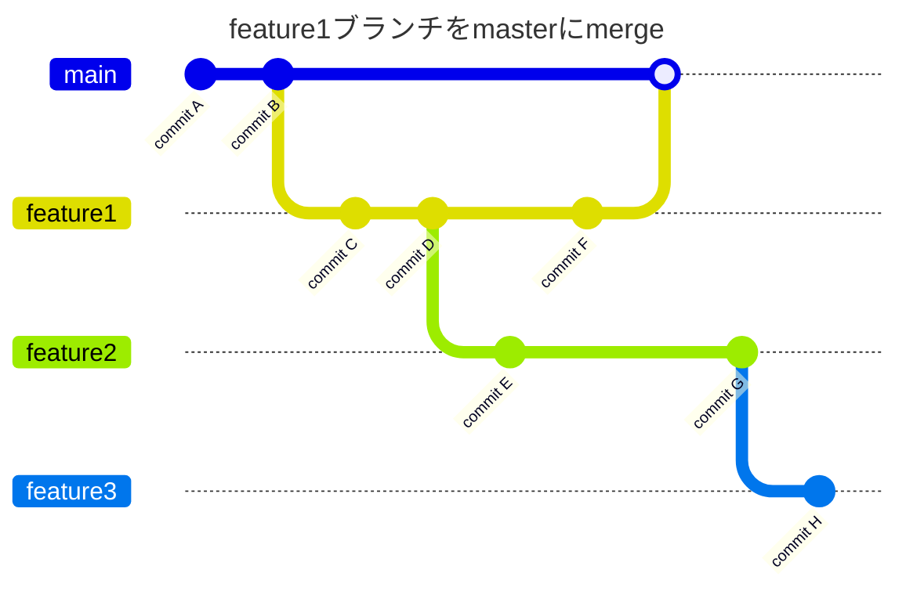
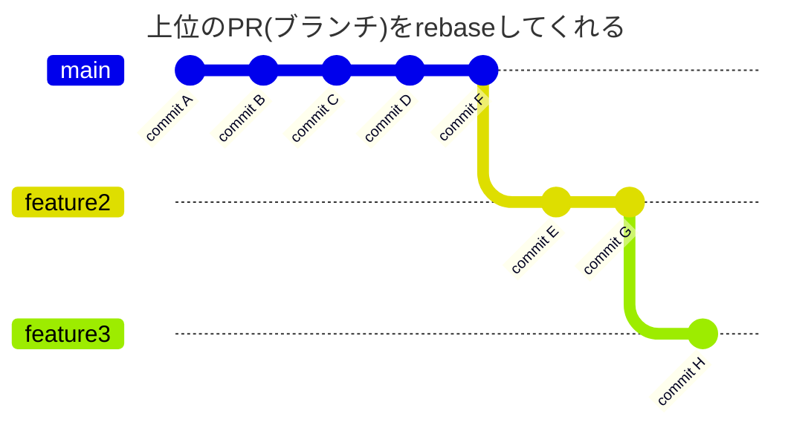

# Stacked Pull Request(1)

## Stacked Pull Request is 何？

> スタックは、同じリポジトリ内の一連のプル要求です。各プル要求は、その下のプル要求のブランチを対象とし、1 つのブランチ (通常はメイン ブランチ) に配置される順序付きチェーンを形成します。

- 複数の一連のPull Request(以下、PR)を仕組みとして一連のものとして扱う

> 1 つの大きなプル要求の代わりに、一連の小さなプル要求を取得します。

- 巨大なPRを小さく分解し、レビューのコストを下げる

  ```mermaid
  ---
  title: ブランチイメージ
  ---
  gitGraph
    switch 'main'
    commit id: 'commit A'
    commit id: 'commit B'
    branch 'feature1'
    commit id: 'commit C'
    commit id: 'commit D'
    branch 'feature2'
    commit id: 'commit E'
    switch 'feature1'
    commit id: 'commit F'
    switch 'feature2'
    commit id: 'commit G'
    branch 'feature3'
    commit id: 'commit H'
  ```

  ```mermaid
  ---
  title: Pull Requestイメージ
  ---
  graph TD;
      A(上位) ---> B(下位);
      C["PR#3 (feature3ブランチ)"] 
      --> D["PR#2 (feature2ブランチ)"] 
      --> E["PR#1 (feature1ブランチ)"]
      --> F["ベースブランチ(masterブランチ)"];
  ```

  

### 何ができるのか？

#### 下位のPRをマージした場合




- 下位のPRをマージすると、その上位PRの向き先がベースブランチに変わる
   
- 一連の上位のPRをrebaseしてくれる
   

#### 上位のPRをマージした場合


- 一連の下位のPRもマージする
   
   

### まとめ

- 一連のPRの下位のPRをマージした場合は、スタックの有無によって動きは大きく変わらない
  - 自動的にrebaseする
- 一連の上位のPRをマージした際に下位のPRもベースブランチにマージする

#### ユースケース

- PRのサイズが巨大である
  - 分解したPR個別ではリリースできない(機能として不十分など)

こういった場合に、上位のPRをマージすることで一連のPRを一括でマージするための機能
